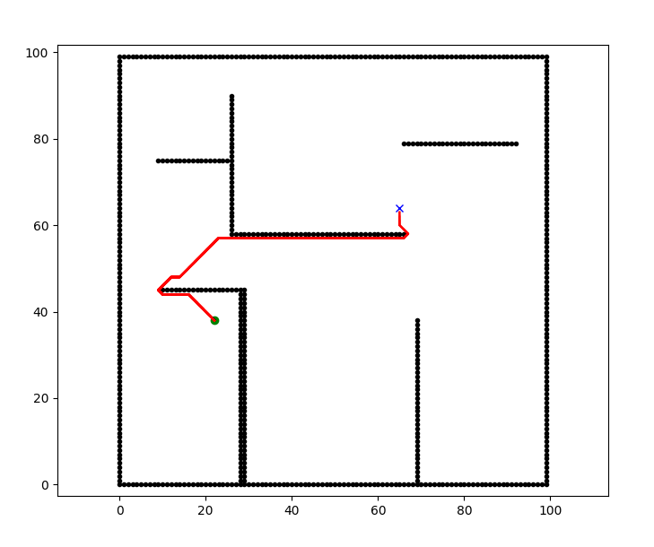

# Mini Project Python Robotics
For this task, I have used the existing implementation of the D* algorithm. I review the given code and modify it in the existing file. You can find my updated code at the following links:https://github.com/ParthbRupapara/-PythonRobotics

1) Converting grayscale images to dynamically create obstacle grid maps:
==> To accomplish this point, I created a function called readGrayScaleImg() that reads grayscale images and finds out the position of obstacles.
For example, you can input the location of your image here:image = cv.imread('./Input_Images/map.png', cv.IMREAD_GRAYSCALE)
This function returns the x and y position of the obstacle, which we can  further use in the main function.

2) In the main function, we used the position of the obstacle grid to create a map dynamically instead of adding the x and y position of the obstacles grid manually. According to your start and destination location, this program will find the shortest path.

# Output Images
